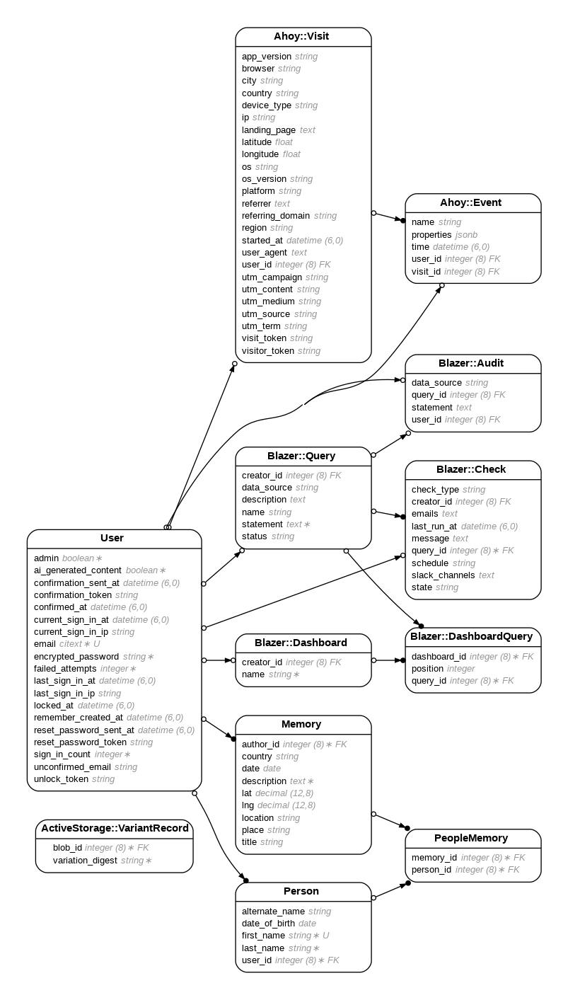

# Pensieve 
## Overview
Pensieve is a web application designed to help users record, organize, and revisit personal and family memories. It offers a user-friendly interface to manage memories, locations, associated individuals, and more. [Full Functional Specification](https://gist.github.com/thierrychau/0d558373c7605ed4459f21a80ea86112)

## Features
- **Dashboard with Map View**: Visual representation of logged memories on an interactive map.
- **Memory Management**: Detailed memory pages with titles, descriptions, locations, pictures, and associated people.
- **Autogenerated Titles**: Utilizing OpenAI to automatically generate titles from memory descriptions.
- **People Management**: Individual profiles for registered individuals, linked to associated memories.
- **Cross-functionality**: Linking people to specific memories for easy reference.

## Getting Started
### Installation and usage
In development, use `bundle` to install all necessary gems:
```bash
bundle install
```
Launch a live preview with:
```bash
rails s
```
or
```bash
bin/dev
```

To populate the app with sample data for testing:
```bash
rails dev:sample_data
```

For resetting the development database:
```bash
rails dev:reset
```
### Dependencies
Pensieve is based on Ruby on Rails. The required gems are listed in the Gemfile. Additionally, accounts and API keys are needed for services like Cloudinary, OpenAI, MapBox, and PostMark.

### Configuration
Set the necessary secret keys as environment variables.
Update the mailers as required.

### Demo
[Pensieve.cc](https://pensieve.cc)

### Entity Relationship Diagram


### Contributing:
#### Issue Reporting

To report issues or bugs, either open a GitHub issue or contact me directly via email at [thierry.chau@gmail.com](mailto:thierry.chau@gmail.com?subject=[GitHub/Pensieve]%20Bugs).

#### Providing Details

When reporting issues, please include specific steps to reproduce errors. Screenshots are appreciated. Tag [thierrychau](https://github.com/thierrychau) in the issue for prompt attention.
